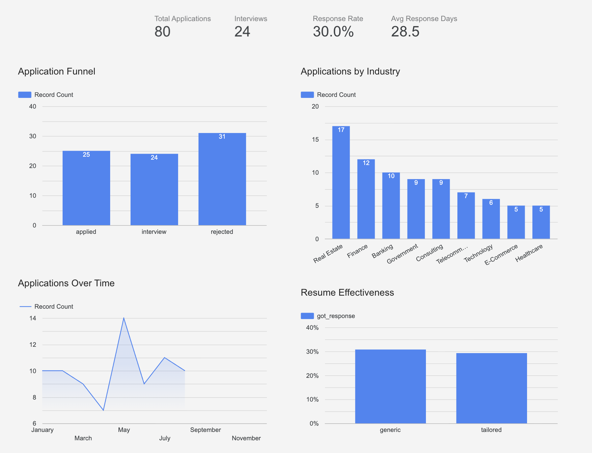

# 🎯 Internship Application Analytics + AI Career Coach

> A full end-to-end data analytics and AI project built to track, analyse and optimise internship applications — combining Python, SQL, Looker Studio and a conversational LLM-powered career coaching tool.

---

## 📌 Project Overview

Most students apply to internships with no systematic tracking or feedback. This project solves that with a complete analytics system built across four components:

1. **Data Pipeline** — Generates and cleans a realistic dataset of 80 internship applications using Python and Pandas
2. **SQL Analysis** — Extracts key insights using SQLite (response rates, resume effectiveness, industry trends)
3. **Interactive Dashboard** — Visualises findings in a live Looker Studio dashboard
4. **AI Career Coach** — A conversational web app that analyses your resume against any job description and provides personalised coaching

The AI Career Coach started as a simple keyword matcher (TF-IDF + cosine similarity) and evolved into a full LLM-powered coaching tool after identifying fundamental limitations in the v1 approach. Both versions are documented to show the thinking process and iteration.

---

## 🛠️ Tools & Technologies

| Category | Tools |
|---|---|
| Languages | Python, SQL |
| Data Processing | Pandas, NumPy |
| NLP (v1) | scikit-learn (TF-IDF, cosine similarity) |
| LLM (v2) | Groq API (LLaMA 3.3 70B + LLaMA 3.1 8B) |
| Web App | Streamlit |
| Database | SQLite |
| Dashboard | Google Looker Studio |
| PDF Processing | PyPDF2 |

---

## 📁 Repository Structure

```
internship-analytics/
│
├── data/
│   └── internship_applications.csv     # Clean dataset (generated by Part 1)
│
├── screenshots/
│   └── dashboard_preview.png           # Looker Studio dashboard screenshot
│
├── part1_data_tracking.py              # Data generation, cleaning, feature engineering
├── part2_sql_analysis.py               # 6 SQL queries with business insights
├── part3_dashboard_guide.md            # Dashboard documentation + live link
├── part4_resume_matcher.py             # NLP prototype v1 (TF-IDF approach)
├── app.py                              # AI Career Coach v2 (LLM-powered web app)
├── requirements.txt                    # Python dependencies
└── README.md
```

---

## 🚀 Quick Start

### Prerequisites
- Python 3.9+
- A free [Groq API key](https://console.groq.com) for the AI Career Coach

### Installation

```bash
# Clone the repository
git clone https://github.com/yourusername/internship-analytics.git
cd internship-analytics

# Install dependencies
pip install -r requirements.txt

# Run the data pipeline
python part1_data_tracking.py

# Run SQL analysis
python part2_sql_analysis.py

# Launch the AI Career Coach
streamlit run app.py
```

### Setting up the AI Career Coach

Create a `.streamlit/secrets.toml` file:
```toml
GROQ_API_KEY = "your-groq-api-key-here"
```

---

## 📊 Part 1 — Data Tracking (Python)

**Script:** `part1_data_tracking.py`

Generates a realistic dataset of 80 internship applications with intentional messiness (mixed case, missing values, inconsistent formatting) to simulate real-world data — then cleans and preprocesses it.

**Key steps:**
- Realistic data generation with weighted distributions (more rejections than offers — as expected in real life)
- Standardisation of categorical columns and date formatting
- Feature engineering: `got_response` binary flag, `status_rank` for funnel ordering, `month_num` for chronological sorting

**Output:** `data/internship_applications.csv` (12 columns, 80 rows)

---

## 🗄️ Part 2 — SQL Analysis (SQLite)

**Script:** `part2_sql_analysis.py`

Loads the clean dataset into SQLite and runs 6 analytical queries, each answering a specific business question.

| Query | Insight |
|---|---|
| Application counts by status | Funnel distribution |
| Response rate | Key KPI — % of applications that progressed |
| Resume type effectiveness | Does tailoring your resume actually help? |
| Monthly trend | When were you most active? |
| Response time by industry | How long does each sector take to respond? |
| Industry breakdown | Where are you focusing effort vs getting results? |

**Key SQL concepts used:** Window functions (`OVER()`), `CASE WHEN`, aggregate functions, `GROUP_CONCAT`

---

## 📈 Part 3 — Looker Studio Dashboard

**Live Dashboard:** [Click here to view →](https://lookerstudio.google.com/reporting/677370dd-57f0-4502-be41-8148d94ce080)

An interactive dashboard built on top of the SQL analysis, featuring:
- Application funnel (Applied → Interview → Rejected)
- KPI scorecard (response rate, total applications, avg response time)
- Industry breakdown bar chart
- Monthly timeline
- Resume type effectiveness comparison

**Data source:** `internship_applications.csv` connected via Google Sheets



---

## 🤖 Part 4 — AI Career Coach (NLP + LLM)

### v1: NLP Prototype (`part4_resume_matcher.py`)

The first approach used TF-IDF keyword extraction and cosine similarity to compute a numeric match score between a resume and job description.

**Limitations discovered through testing:**
- TF-IDF extracted noise words ("able", "accurate") as skill gaps
- Keyword matching has no semantic understanding — "data viz" ≠ "visualisation"
- Numeric score implies false precision
- Static output — couldn't surface hidden experience
- Clinical tone — not useful or encouraging to the user

These limitations motivated a complete rebuild.

### v2: AI Career Coach (`app.py`) — [Live Demo →](https://internship-analytics.streamlit.app/)

A full conversational coaching web app that addresses every v1 limitation:

| v1 Problem | v2 Solution |
|---|---|
| Fake numeric score | 4-tier qualitative verdict (Exceptional / Strong / Solid with Gaps / Needs Work) |
| TF-IDF noise | LLM-powered gap detection reads context directly |
| Matched keywords redundant | Removed — focused on gaps and fixes only |
| Clinical tone | Warm, encouraging coaching voice throughout |
| Can't surface hidden experience | Dynamic clarifying questions recover unlisted skills |

**Features:**
- 📄 Upload PDF resume once — reused across all roles in a session
- ⚡ Quick Assessment (instant report) or 🎓 Full Coaching Session (Q&A)
- 🎨 Colour-coded report cards with verdict, strengths, gaps, action plan
- 📋 Sidebar navigation between past role analyses
- 💬 Free Q&A after each report — ask anything career-related
- 🎯 Session summary with per-role insights at the end

---

## 💡 Key Insights from the Data

- **30% response rate** — above the typical 10–20% industry benchmark
- **May had the highest application volume** (14 applications) and response rate
- **Banking and Technology** tied for best response rate at 50%
- **Consulting** had the lowest response rate (11%) despite high effort
- **Tailored vs generic resumes** — tracked and compared using the `got_response` flag

---

## 🔮 Future Improvements

- [ ] Persistent storage for the Career Coach (save sessions across visits)
- [ ] OCR support for scanned PDF resumes
- [ ] Integration with LinkedIn job listings API for live JD fetching
- [ ] BERT/sentence embeddings for semantic skill matching
- [ ] User authentication for multi-user deployment

---

## ⚠️ Limitations

- Dataset is simulated — real insights require real tracking data
- AI Career Coach uses keyword + LLM analysis — not a guarantee of fit
- Groq free tier has rate limits — may be slow under heavy usage
- PDF extraction works best on text-based PDFs (not scanned images)

---

## 📬 Contact

**Jonah Choke**
- GitHub: [@jchoke123](https://github.com/jchoke123)
- LinkedIn: [linkedin.com/in/jonah-choke-520a94341](linkedin.com/in/jonah-choke-520a94341)
- Email: jchoke001@e.ntu.edu.sg
